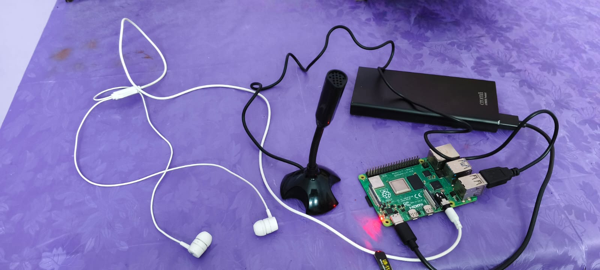

# ExamMate 🎓🎤

ExamMate is an offline voice-enabled exam preparation system designed for competitive exams like TNPSC.  
It runs on Raspberry Pi and helps students learn using voice interaction.

## Features
- Offline Speech-to-Text (STT)
- Offline Text-to-Speech (TTS)
- Voice-based question answering
- Subject-wise question bank
- Beginner-friendly and low-cost system

## Hardware Used
- Raspberry Pi
- USB Microphone
- Speaker / Headphones

## Software Overview
- Python-based implementation
- Modular architecture for easy expansion
- Offline operation (No Internet Required)

## Demo

Below is the actual project setup of ExamMate:

## Applications
- TNPSC exam preparation
- Rural education support
- Smart learning systems

## Future Enhancements
- Multilingual support
- Difficulty-level based questions
- Mobile app integration

